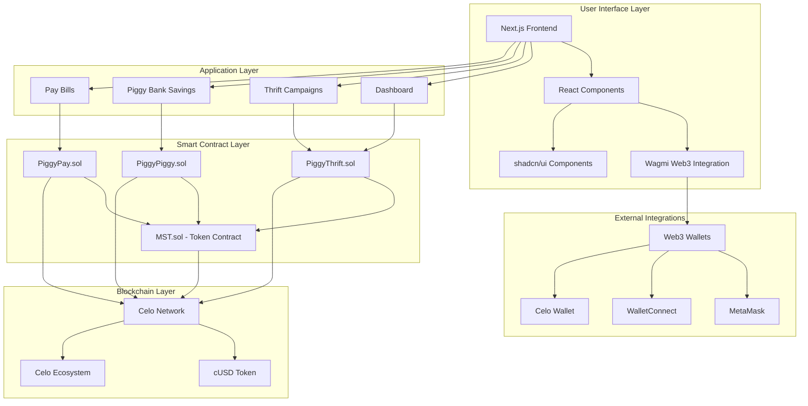

# PiggySavfe

A decentralized savings platform built on Celo blockchain that enables users to participate in rotating savings groups (Esusu) and automated savings plans. Experience community-powered wealth building with bank-grade security through smart contracts.

## Features

### Core Functionality
- **Rotating Savings Groups (Piggy Thrift)**: Join or create thrift campaigns with 2-5 participants
- **Automated Piggy Bank Savings**: Set up recurring savings with flexible contribution schedules
- **Pay Bills Integration**: Pay utility bills and earn rewards through the platform
- **Multi-Token Support**: Native support for cUSD and other Celo ecosystem tokens

### User Experience
- **Intuitive Dashboard**: Comprehensive overview of all savings activities
- **Real-time Updates**: Live progress tracking and notifications
- **Mobile-First Design**: Responsive interface optimized for all devices
- **Wallet Integration**: Seamless connection with popular Web3 wallets

### Security & Trust
- **Smart Contract Audited**: All contracts deployed on Celo mainnet
- **Transparent Operations**: Full visibility into savings pools and distributions
- **Community Governance**: Decentralized decision-making for platform upgrades

## Architecture



### Architecture Overview

**Frontend Layer**: Built with Next.js 14, TypeScript, and Tailwind CSS for modern, responsive web applications.

**Smart Contracts**: Solidity contracts deployed on Celo blockchain, handling all savings logic, token transfers, and automated distributions.

**Blockchain Integration**: Direct interaction with Celo network using Wagmi hooks for seamless Web3 functionality.

**External Services**: Integration with popular Web3 wallets and Celo ecosystem tools.

## Tech Stack

### Frontend
- **Framework**: Next.js 14 with App Router
- **Language**: TypeScript
- **Styling**: Tailwind CSS + shadcn/ui components
- **Animations**: AOS (Animate On Scroll)
- **Web3**: Wagmi + Viem
- **State Management**: React hooks

### Backend (Smart Contracts)
- **Language**: Solidity ^0.8.20
- **Framework**: Foundry
- **Libraries**: OpenZeppelin Contracts
- **Testing**: Forge (Foundry's testing framework)

### Blockchain
- **Network**: Celo Mainnet
- **Tokens**: cUSD (primary), support for other ERC-20 tokens
- **Oracles**: Chainlink (for price feeds if needed)

### Development Tools
- **Package Manager**: npm
- **Code Quality**: ESLint, Prettier
- **Version Control**: Git
- **Deployment**: Vercel (frontend), Foundry scripts (contracts)

## Installation

### Prerequisites
- Node.js 18+ and npm
- Foundry (for smart contract development)
- Git

### Clone the Repository
```bash
git clone https://github.com/your-username/piggy-savfe.git
cd piggy-savfe
```

### Smart Contracts Setup
```bash
# Install Foundry dependencies
cd contracts
forge install

# Run tests
forge test

# Deploy to Celo testnet (Alfajores)
forge script script/Deploy.s.sol --rpc-url $CELO_RPC_URL --private-key $PRIVATE_KEY --broadcast
```

### Frontend Setup
```bash
# Install dependencies
cd frontend
npm install

# Set up environment variables
cp .env.example .env.local
# Edit .env.local with your configuration

# Run development server
npm run dev
```

### Environment Variables
Create a `.env.local` file in the frontend directory:

```env
NEXT_PUBLIC_CELO_RPC_URL=https://forno.celo.org
NEXT_PUBLIC_CONTRACT_ADDRESS_Piggy_THRIFT=0x...
NEXT_PUBLIC_CONTRACT_ADDRESS_Piggy_PIGGY=0x...
NEXT_PUBLIC_CONTRACT_ADDRESS_Piggy_PAY=0x...
NEXT_PUBLIC_CONTRACT_ADDRESS_MST=0x...
```

## Usage

### For Users
1. **Connect Wallet**: Use MetaMask or any Web3 wallet to connect
2. **Choose Savings Type**:
   - **Thrift**: Join or create rotating savings groups
   - **Piggy Bank**: Set up automated recurring savings
   - **Pay Bills**: Earn rewards while paying utilities
3. **Monitor Progress**: Track savings on the dashboard
4. **Receive Payouts**: Automated distributions based on group rules

### For Developers
```typescript
// Example: Create a thrift campaign
import { writeContract } from 'wagmi'

const createCampaign = async () => {
  await writeContract({
    address: Piggy_THRIFT_ADDRESS,
    abi: thriftAbi,
    functionName: 'createCampaign',
    args: [participants, contributionAmount]
  })
}
```

## Testing

### Smart Contracts
```bash
cd contracts
forge test --gas-report
```

### Frontend
```bash
cd frontend
npm run test
npm run build
```

## Contributing

We welcome contributions! Please follow these steps:

1. Fork the repository
2. Create a feature branch (`git checkout -b feature/amazing-feature`)
3. Commit your changes (`git commit -m 'Add amazing feature'`)
4. Push to the branch (`git push origin feature/amazing-feature`)
5. Open a Pull Request

### Development Guidelines
- Follow TypeScript best practices
- Write comprehensive tests for new features
- Update documentation for API changes
- Ensure responsive design for all components

## License

This project is licensed under the MIT License - see the [LICENSE](LICENSE) file for details.

## Contact

- **Project Lead**: [Your Name]
- **Email**: contact@piggysavfe.com
- **Twitter**: [@PiggySavfe](https://twitter.com/PiggySavfe)
- **Discord**: [Join our community](https://discord.gg/piggysavfe)

## Acknowledgments

- **Celo Foundation** for the amazing blockchain infrastructure
- **OpenZeppelin** for secure smart contract libraries
- **shadcn/ui** for beautiful React components
- **Foundry** for excellent Solidity development tools

---

Built with love on Celo for a decentralized future
